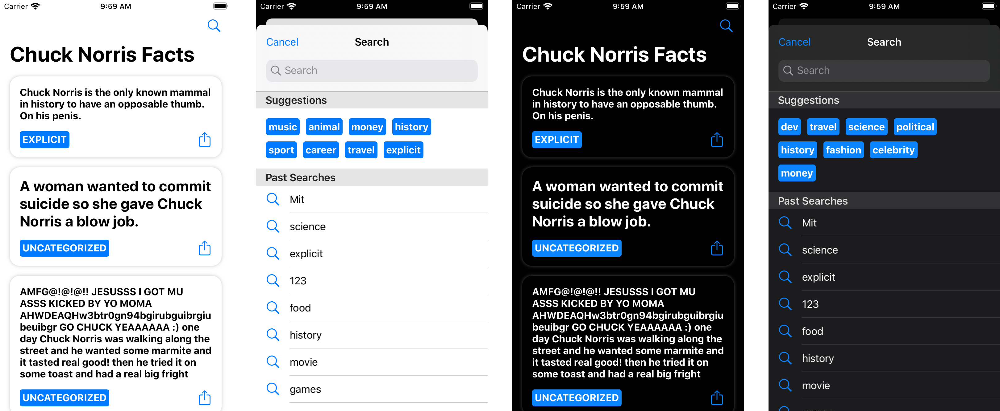

# Chuck Norris Facts
Funny facts about Chuck Norris provided by https://api.chucknorris.io.

## Screenshots

  

## Getting started

### Requirements
This application was developed using these tools and no have warranty that it runs on older versions.
- Xcode 11.7
- Swift 5
- Cocoapods 1.9.3

### How to run
1. You should clone the repository
`$ git clone git@github.com:djorkaeffalexandre/chuck-norris-facts.git`
2. Enter the project folder
`$ cd chuck-norris-facts`
3. Install dependencies
`$ pod install`
4. Open the project on Xcode
`$ open -a Xcode Chuck\ Norris\ Facts.xcworkspace`

## Architecture
This application conforms to [MVVM-C (Model-View-ViewModel-Coordinators)](https://stevenpcurtis.medium.com/mvvm-c-architecture-with-dependency-injection-testing-3b7197eb2e4d) pattern,
that helps with separation of concerns and allows testing and implementation to be better than [MVC](https://medium.com/swift-coding/mvc-in-swift-a9b1121ab6f0).
This application uses [RxSwift](https://github.com/ReactiveX/RxSwift) which allows reacting to changes even with multiple threads and with lot less code, complexity and bugs.
Using [RxSwift](https://github.com/ReactiveX/RxSwift) and [RxRealm](https://github.com/RxSwiftCommunity/RxRealm) we can listen to database changes and binding them to Views, View Models and View Controllers.

### Dependencies
- [RxSwift/RxCocoa](https://github.com/ReactiveX/RxSwift) Reactive Programming in Swift.
- [RxDataSources](https://github.com/RxSwiftCommunity/RxDataSources) UITableView and UICollectionView Data Sources for RxSwift.
- [RxRealm](https://github.com/RxSwiftCommunity/RxRealm) RxSwift extension for RealmSwift's types.
- [SwiftLint](https://github.com/realm/SwiftLint) A tool to enforce Swift style and conventions.
- [SwiftGen](https://github.com/SwiftGen/SwiftGen) The Swift code generator for Localizable.strings.
- [Lottie](https://github.com/airbnb/lottie-ios) An iOS library to natively render After Effects vector animations.
- [Moya](https://github.com/Moya/Moya) Network abstraction layer written in Swift.
- [RealmSwift](https://github.com/realm/realm-cocoa) Realm is a mobile database: a replacement for Core Data & SQLite.

## Fastlane
We use [Fastlane](https://github.com/fastlane/fastlane) to provide CLI commands to easily build, test and deploy the application on Continuous Integration and Delivery platforms.
You should install [Fastlane](https://github.com/fastlane/fastlane) and it's plugins using `$ bundle install`.

### Commands
- Run Unit and UI tests (Running on Github Actions)
`$ fastlane ios tests`

- Release the app to Test Flight (Beta Release)
`$ fastlane ios beta`

## Contact
Email: djorkaeff7@icloud.com
